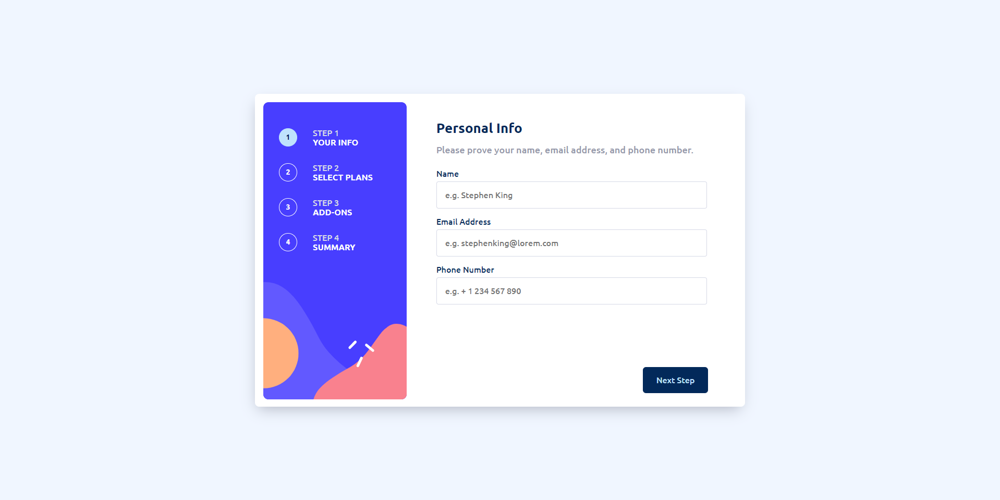

# Frontend Mentor - Multi-step form solution

This is a solution to the [Multi-step form challenge on Frontend Mentor](https://www.frontendmentor.io/challenges/multistep-form-YVAnSdqQBJ). Frontend Mentor challenges help you improve your coding skills by building realistic projects.

## Table of contents

- [Overview](#overview)
  - [The challenge](#the-challenge)
  - [Screenshot](#screenshot)
  - [Links](#links)
- [My process](#my-process)
  - [Built with](#built-with)
  - [What I learned](#what-i-learned)
  - [Continued development](#continued-development)
  - [Useful resources](#useful-resources)
- [Author](#author)
- [Acknowledgments](#acknowledgments)

**Note: Delete this note and update the table of contents based on what sections you keep.**

## Overview

### The challenge

Users should be able to:

- Complete each step of the sequence
- See a summary of their selections on the final step and confirm their order
- View the optimal layout for the interface depending on their device's screen size
- See hover and focus states for all interactive elements on the page

### Screenshot

### Links

- Solution URL: [https://github.com/theadg/multi-step-form]
- Live Site URL: [https://theadg.github.io/multi-step-form/]

## My process

### Built with

- Semantic HTML5 markup
- CSS custom properties
- SASS
- BEM Naming Convention
- Flexbox
- CSS Grid
- Mobile-first workflow
- Webpack

### What I learned

In this project, I was more focused on improving my process, how I do things from start to end. I believe that I have improved my development process as I was more productive and more efficient with my time with this project. I have applied my knowledge about CSS Grid and Flexbox. I have also used JavaScript's ES6 import and export modules to have a separation of concerns, for easier maintenance. I have also taken into practice form validation and dom manipulation. Overall, this project was an application of my existing knowledge and I'm very proud. :)

### Continued development

I would love to create more Front-End Mentor projects, whilst incorporating the best practices and trying out new technologies.

## Author

- Github - [@theadg](https://github.com/theadg)
- Frontend Mentor - [@theadg](https://www.frontendmentor.io/profile/theadg)
